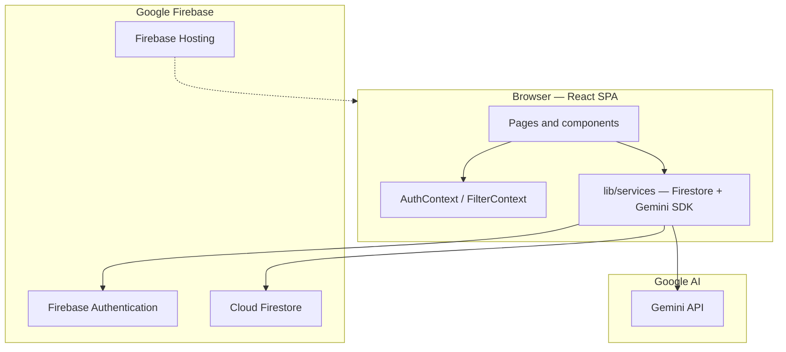
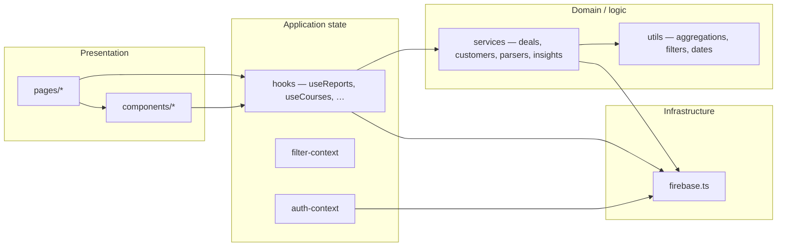
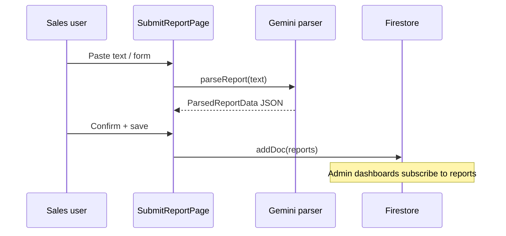
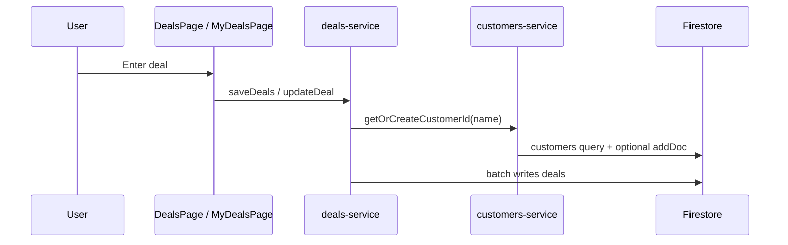
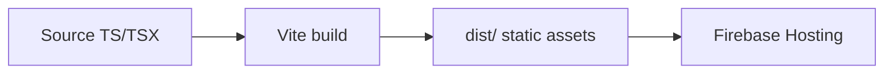

# System Architecture

ISE Sales Dashboard is a **single-page application (SPA)** built with **Vite + React 19**. There is **no dedicated backend repository** in this project: persistence and auth use **Firebase** (Auth + Firestore), and **Google Gemini** is called from the **browser** for NLP parsing and insights.

**Related:** [README.md](../README.md) · [DATABASE.md](./DATABASE.md) · [API.md](./API.md)

---

## High-level architecture



---

## Layered view



---

## Routing and access control

```mermaid
flowchart TD
  A[User visits URL] --> B{Authenticated?}
  B -->|No| L[/login]
  B -->|Yes| C{ProtectedRoute}
  C --> D{Role matches allowedRoles?}
  D -->|No| R[Redirect to role home]
  D -->|Yes| E[AppLayout + page]
```

- **Route guards** live in `src/App.tsx` (`ProtectedRoute`); **authorization** for data is enforced by **Firestore security rules** (`firestore.rules`).
- **Sales** users are routed toward `/submit-report` at `/`; **admin/superadmin** toward `/dashboard`.

---

## Data flow (reports)



---

## Data flow (deals)



---

## Build and deployment



- `firebase.json` configures **Firebase Hosting** with optional **frameworks backend** region (`europe-west1`). There is **no** Cloud Functions code in this repo.

---

## Key design decisions

| Decision | Rationale |
|----------|-----------|
| **Client-only API calls to Gemini** | Simplicity; **trade-off:** API keys exposed in browser (mitigate with server proxy + App Check in production). |
| **Firestore as single source of truth** | Real-time updates via `onSnapshot` for dashboards. |
| **Parsed funnel in `reports.parsedData`** | Flexible JSON from Gemini; aggregations in `lib/utils`. |
| **Separate `deals` collection** | Closed-won revenue and cycle metrics independent of daily funnel reports. |

---

## External dependencies (conceptual)

- **Firebase Auth:** identity; **Firestore:** documents and security rules.
- **Gemini:** structured extraction and AI insight JSON.
- **Recharts:** charts; **date-fns:** formatting in insights UI.

---

## Files and modules map

| Area | Path |
|------|------|
| Entry | `src/main.tsx`, `src/App.tsx` |
| Firebase | `src/lib/firebase.ts` |
| Auth | `src/lib/auth-context.tsx` |
| Global filters | `src/lib/filter-context.tsx` |
| Aggregations | `src/lib/utils/dashboard-aggregations.ts`, `dashboard-analytics.ts`, `dashboard-filters.ts` |
| Firestore services | `src/lib/services/deals-service.ts`, `customers-service.ts`, `insights-firestore.ts` |
| AI | `src/lib/services/gemini-parser.ts`, `ai-insights-service.ts` |
