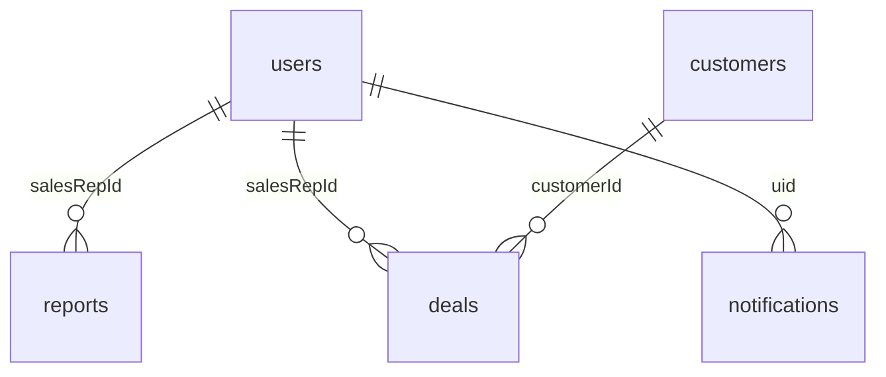

# Database Schema (Firestore)

Firestore is a **document database**. Collections are listed below with **field-level** descriptions as used by the app. **Relationships** are logical (references by ID or matched names), not foreign-key constraints.

**Related:** [Firestore rules](../firestore.rules) · [API.md](./API.md) · [BUSINESS_LOGIC.md](./BUSINESS_LOGIC.md)

---

## Conventions

- **Timestamps:** Firestore `Timestamp` or `serverTimestamp()` on write; client may read `.toDate()`.
- **IDs:** Document IDs are auto-generated (`addDoc`) or explicit (`setDoc` with Auth `uid`).
- **Arabic UI:** Display names and enums may be Arabic strings in `platform`, `parsedData`, etc.

---

## Entity relationship (logical)

---

## Collection: `users`

**Path:** `users/{userId}`

| Field | Type | Description |
|-------|------|-------------|
| `name` | string | Display name |
| `email` | string | Login email (lowercase in some flows) |
| `role` | string | `sales` \| `admin` \| `superadmin` |
| `isActive` | boolean | If false, auth flow may sign user out |
| `teamName` | string \| null | Optional team label |
| `programTrack` | string \| null | Optional program track |
| `addedAt` | Timestamp | When profile created |
| `addedBy` | string | Optional UID of admin who added |
| `lastLogin` | Timestamp | Optional |

**Rules:** Read for any authenticated user; create/update **admin+**; delete **superadmin only**.

**Note:** `AccessPage` sets `users/{uid}` to match **Firebase Auth UID**. `AddMemberModal` uses `addDoc` (auto ID)—may **not** match Auth UID until reconciled.

---

## Collection: `reports`

**Path:** `reports/{reportId}`

| Field | Type | Description |
|-------|------|-------------|
| `date` | string | Business date (`YYYY-MM-DD` or `DD/MM/YYYY`) |
| `platform` | string | e.g. WhatsApp / Messenger / TikTok (Arabic or English) |
| `salesRepId` | string | Firebase Auth UID |
| `salesRepName` | string | Display name at submit time |
| `rawText` | string \| null | Original paste (null if form-only entry) |
| `entryMode` | string | `form` \| `template` |
| `parsedData` | map | Structured funnel + metrics (see `ParsedReportData` in `gemini-parser.ts`) |
| `confirmed` | boolean | User confirmed before save |
| `createdAt` | Timestamp | Submission time |

**Nested `parsedData` highlights:**

| Area | Fields |
|------|--------|
| Totals | `totalMessages`, `interactions`, `conversionRate`, `jobConfusionCount` |
| Funnel | `funnel`: `noReplyAfterGreeting`, `noReplyAfterDetails`, `noReplyAfterPrice`, `repliedAfterPrice` (arrays of `{ adName, count, … }`) |
| Rejections | `rejectionReasons[]`: `rawText`, `count`, `category` |
| Deals | `closedDeals` (often cleared on save in current flow) |

**Rules:** Read **admin** or **owner** (`salesRepId`); create **authenticated**; **no update**; delete **superadmin**.

---

## Collection: `deals`

**Path:** `deals/{dealId}`

| Field | Type | Description |
|-------|------|-------------|
| `salesRepId` | string | Owner rep UID |
| `salesRepName` | string | Display name |
| `teamName` | string \| null | Optional |
| `date` | string | Typically close date `YYYY-MM-DD` |
| `customerId` | string | Reference to `customers` |
| `customerName` | string | Denormalized name |
| `adSource` | string | Ad / source label |
| `programName` | string | Program |
| `programCount` | number | Count (≥ 1 when normalized) |
| `dealValue` | number | Revenue amount |
| `firstContactDate` | string \| null | Optional ISO-like date |
| `closeDate` | string | Close date |
| `closingCycleDays` | number \| null | Days first contact → close |
| `products` | array of string | Product IDs |
| `closureType` | string | `call` \| `self` |
| `createdAt` | Timestamp | |

**Rules:** Read **admin** or owner; create **authenticated**; update **admin** or owner; delete **superadmin** or owner (including legacy **name-only** match when `salesRepId` null).

---

## Collection: `customers`

**Path:** `customers/{customerId}`

| Field | Type | Description |
|-------|------|-------------|
| `normalizedKey` | string | Normalized lowercase name for deduplication |
| `displayName` | string | Original display string |
| `createdAt` | Timestamp | |

**Rules:** Read **authenticated**; create **authenticated**; update **admin**; delete **superadmin**.

---

## Collection: `courses`

**Path:** `courses/{courseId}`

| Field | Type | Description |
|-------|------|-------------|
| `name` | string | Course name |
| `shortCode` | string | Short code |
| `isActive` | boolean | Shown in pickers when active |
| `order` | number | Sort order |
| `createdAt` | Timestamp | Optional |

**Rules:** Read **authenticated**; write **admin**.

---

## Collection: `insights`

**Path:** `insights/{insightId}`

Saved AI insight reports (summary, issues, recommendations, snapshot).

| Field | Type | Description |
|-------|------|-------------|
| `name` | string | User-given title |
| `period` | string | e.g. `today`, `week`, `month`, `all` |
| `periodLabel` | string | Arabic label |
| `dateFrom`, `dateTo` | string | YYYY-MM-DD |
| `summary` | string | |
| `criticalIssues` | array | AI insight items |
| `positivePoints` | array | |
| `recommendations` | array | |
| `dataSnapshot` | map | `totalMessages`, `totalInteractions`, `conversionRate`, `reportsCount`, `salesRepsCount` |
| `savedBy` | string | UID |
| `savedByName` | string | |
| `savedAt` | Timestamp | |

**Rules:** Read/write **admin**; delete **superadmin**.

---

## Collection: `notifications`

**Path:** `notifications/{notifId}`

| Field | Type | Description |
|-------|------|-------------|
| `uid` | string | Recipient user |
| `type` | string | e.g. `new_excuse`, `missed_report`, … |
| `message` | string | |
| `read` | boolean | |
| `createdAt` | Timestamp | |
| `link` | string | Optional in-app path |

**Rules:** Read/update own; create **admin**; delete denied in rules.

---

## Collection: `excuses`

**Path:** `excuses/{excuseId}`

Used for leave/absence workflow (admin UI). Fields used in components include **`userId`**, **`date`**, **`status`** (`pending` \| `approved` \| `rejected`), **`userName`**.

**Rules:** Reference **`salesRepId`** in security rules for reads—**ensure documents align** with app fields (`userId` vs `salesRepId`).

---

## Collection: `attendance`

**Path:** `attendance/{recordId}`

Present in **rules** and admin cleanup lists; **no active writes** were found in `src/` at documentation time. Attendance UX derives from **reports** + **excuses** in hooks.

---

## Indexes

The app uses Firestore queries with `where` + `orderBy` (e.g. `reports` by `salesRepId` + `createdAt`). **Composite indexes** may be required—if Firestore returns an index error, create the suggested index in the Firebase Console or `firestore.indexes.json` if added to the project.

---

## Product catalog (code, not Firestore)

`lib/constants/products.ts` defines **product IDs** for deal pickers (`ProductPicker`), not a Firestore collection.
